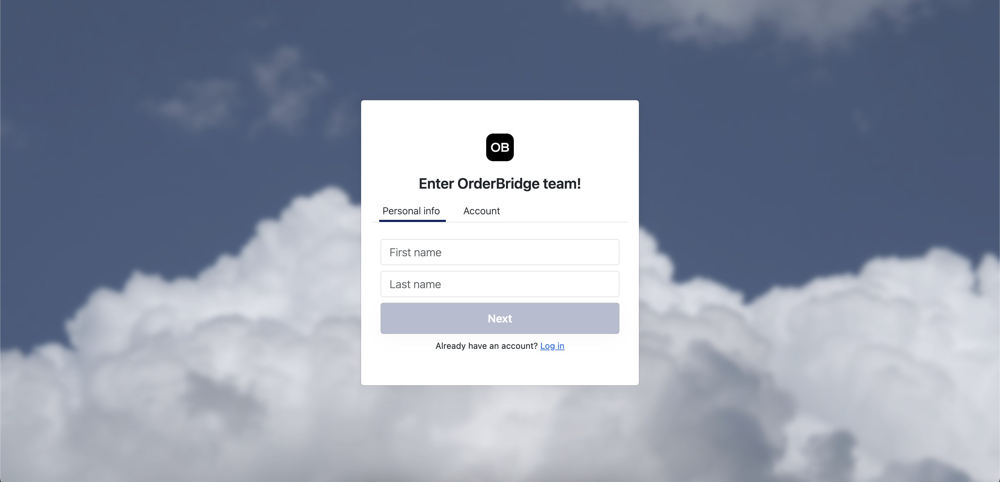
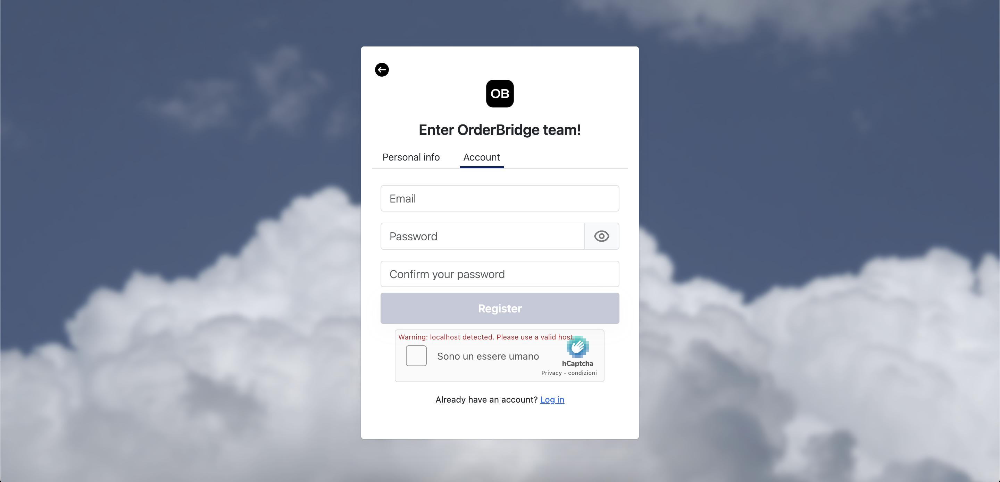
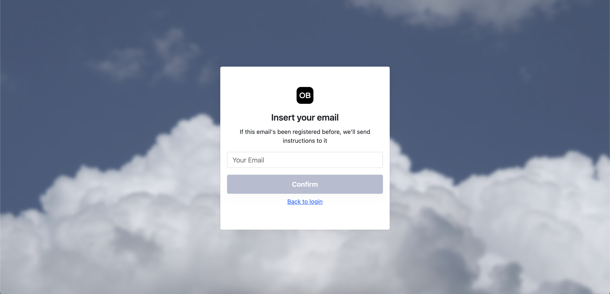
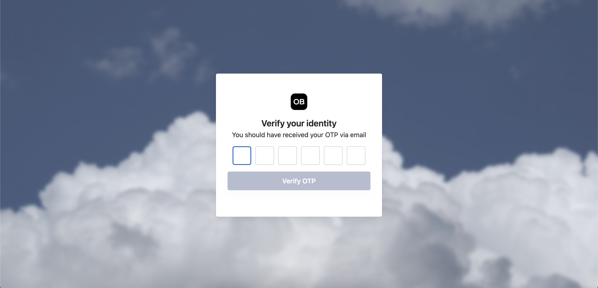
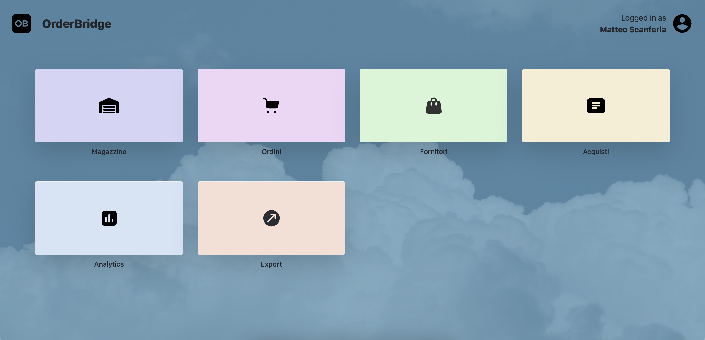
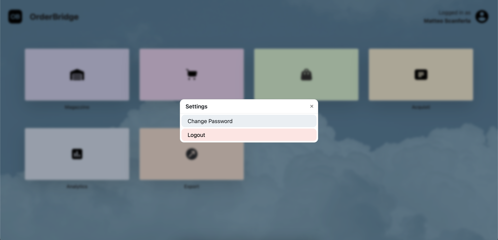
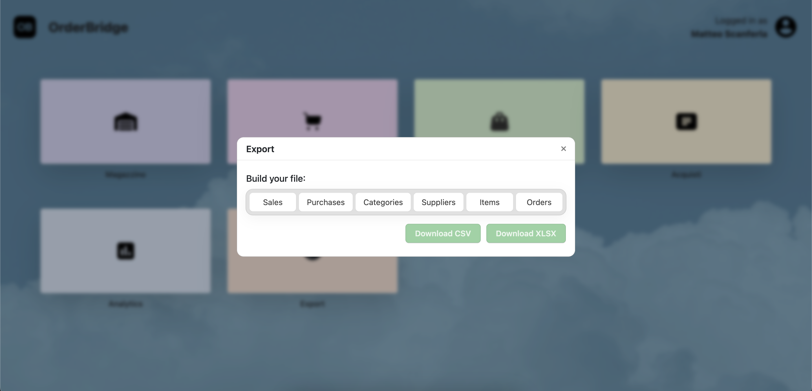
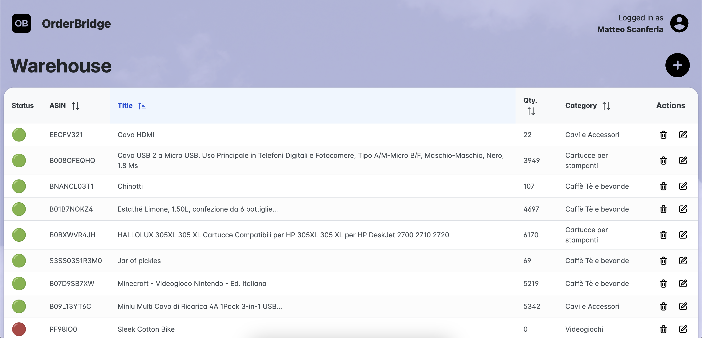
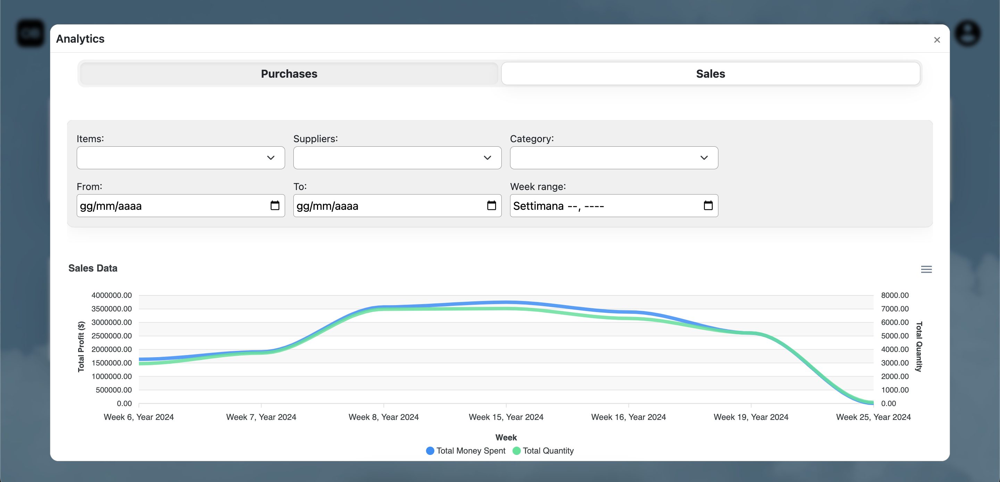

# Project Title

## Table of Contents
- [Login](#login)
- [Register - Step 1](#register---step-1)
- [Register - Step 2](#register---step-2)
- [Send Email for Reset Password](#send-email-for-reset-password)
- [OTP Verification](#otp-verification)
- [Dashboard](#dashboard)
- [Settings Modal](#settings-modal)
- [Export Modal](#export-modal)
- [Warehouse Management](#warehouse-management)
- [Analytics](#analytics)

## Login

## Register - Step 1

## Register - Step 2

## Send Email for Reset Password

## OTP Verification

## Dashboard

## Settings Modal

## Export Modal

## Warehouse Management

## Analytics

